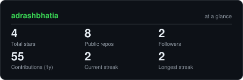

<div align="center">

<h1 align="center">Adrash Bhatia</h1>

<!-- PORTRAIT - generated by scripts/dotify.py from your photo:
     python scripts/dotify.py my_pic.png -o assets/portrait --cols 110 --crop-bottom 0.25 --gamma 1.6 -->


<br>

<!-- NAME / TAGLINE - animated typing -->
<a href="https://github.com/adrashbhatia">
  
</a>

<br>

<!-- SOCIALS - replace the links with your own -->
<a href="https://www.linkedin.com/in/adrash-bhatia-9668952b5"></a>
<a href="mailto:bhatiaadrash@gmail.com"></a>

</div>

---

## `~/` whoami

```console
$ cat about.txt
```

Hi, I'm **Adrash Bhatia**. I'm a final year Computer Science student, **Android & Backend Developer** (Java, Spring Boot, MySQL) and the **Founder of RouteBook**. I like building things from scratch, bringing people together, and turning ideas into real products.

- Founder of **RouteBook** — *(add one line about what RouteBook does)*
- Part of **Mindtrek 2.0** and many other events across the ecosystem
- Projects: **LMS-App** (Android learning management system), **AI Job Recommendation System**, **Fake News Detector**, ML disease prediction
- Open to connecting with investors, mentors, and fellow founders

<br>

---

## `~/` projects

| Project | What it is | Stack |
| --- | --- | --- |
| [**LMS-App**](https://github.com/adrashbhatia/LMS-App) | Android learning management system with student, teacher and admin portals | Java, Android |
| [**AI-Job-Recommendation-System**](https://github.com/adrashbhatia/AI-Job-Recommendation-System) | Job recommendations using KNN, Random Forest and ANN | Python, ML |
| [**fake_news_detector**](https://github.com/adrashbhatia/fake_news_detector) | TruthLens - AI fake news detector | Python, ML |
| [**ML-LAB--Midterm-Project**](https://github.com/adrashbhatia/ML-LAB--Midterm-Project) | Patient disease prediction using machine learning | Jupyter Notebook |
| [**portfolio**](https://github.com/adrashbhatia/portfolio) | Personal portfolio website | TypeScript |

---

## `~/` routebook

**RouteBook** — *(add one line about what RouteBook does)*

Founder, building it from the ground up while finishing my final year.

## `~/` events

- **Mindtrek 2.0**
- *(add more events here)*

<div align="center">

## `~/` toolbox

<!-- Pick icons from https://skillicons.dev and edit the list after i= -->


</div>

---

<div align="center">

## `~/` skill radar

<table>
<tr>
<td width="50%" align="center" valign="middle">

<!-- Self-rated radar - edit assets/skills.json, the workflow redraws it -->
<picture>
  <source media="(prefers-color-scheme: dark)"  srcset="assets/radar-dark.svg">
  <source media="(prefers-color-scheme: light)" srcset="assets/radar-light.svg">
  
</picture>

</td>
<td width="50%" align="center" valign="middle">

<!-- Live radar built from real language byte counts across your repos -->
<picture>
  <source media="(prefers-color-scheme: dark)"  srcset="assets/radar-langs-dark.svg">
  <source media="(prefers-color-scheme: light)" srcset="assets/radar-langs-light.svg">
  
</picture>

</td>
</tr>
</table>

</div>

---

<div align="center">

## `~/` contribution graph

<!-- Snake eats the contribution graph - .github/workflows/snake.yml -->
<picture>
  <source media="(prefers-color-scheme: dark)"  srcset="https://raw.githubusercontent.com/adrashbhatia/adrashbhatia/output/snake-dark.svg">
  <source media="(prefers-color-scheme: light)" srcset="https://raw.githubusercontent.com/adrashbhatia/adrashbhatia/output/snake.svg">
  
</picture>

</div>

---

<div align="center">

## `~/` the numbers

<!-- Generated by scripts/cards.py into this repo. -->
<picture>
  <source media="(prefers-color-scheme: dark)"  srcset="assets/card-stats-dark.svg">
  <source media="(prefers-color-scheme: light)" srcset="assets/card-stats-light.svg">
  
</picture>

<br>


</div>

---

<div align="center">

<sub><em>"Building RouteBook, one route at a time."</em></sub>

</div>
